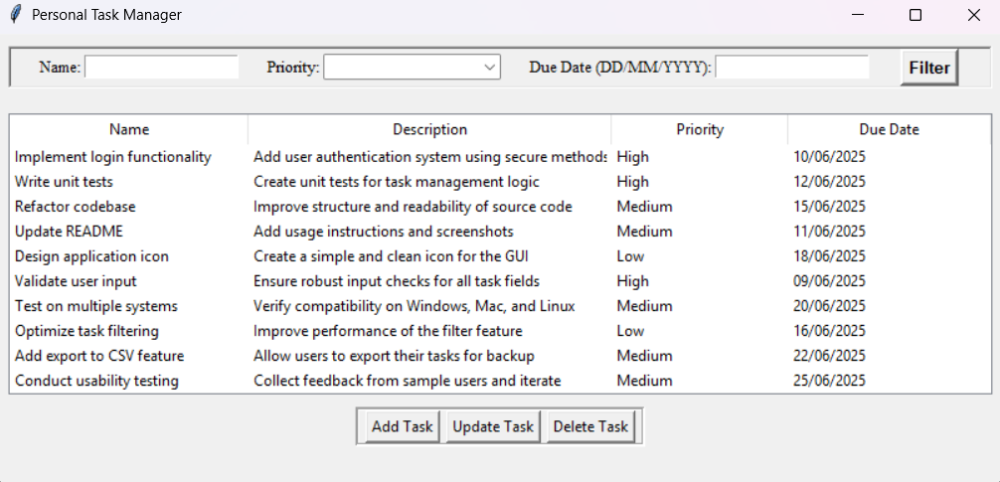
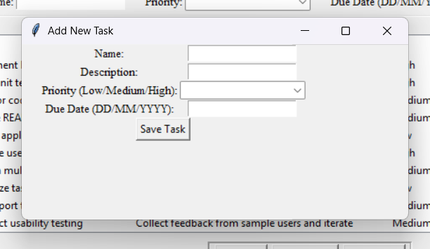
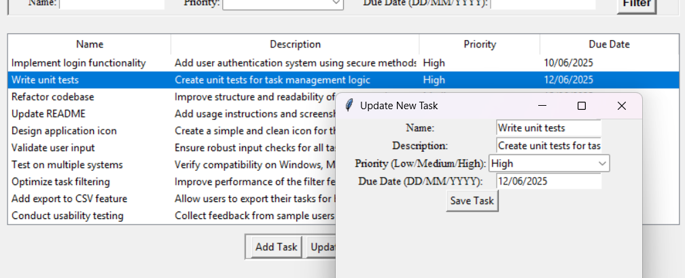
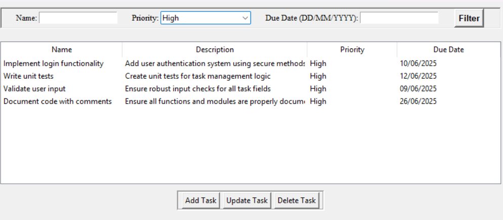
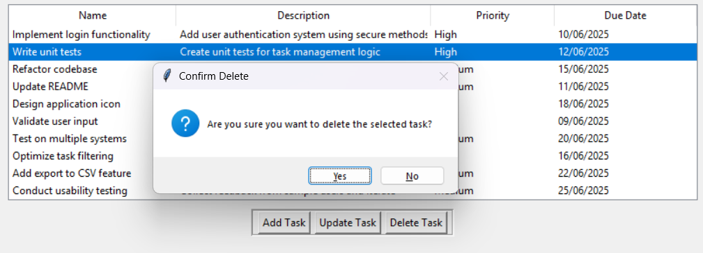
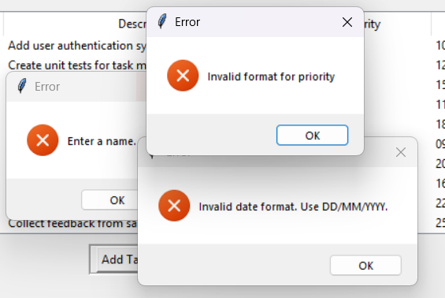

## 📝 Personal Task Manager 


A Python OOP-based desktop personal task management application built with Tkinter, developed as a first-year university coursework project. <br>
Designed to help users efficiently organize, track, and prioritize tasks with persistent storage using JSON.

<br>

---

## 🚀 Features 
- Add, Update, and Delete Tasks – Easily manage your tasks through a simple GUI.
- Task Filtering – Filter tasks by name, priority (Low/Medium/High), or due date.
- Sorting Functionality – Sort tasks by name, description, priority, or due date in ascending/descending order.
- Persistent Storage – Tasks are saved in a JSON file (tasks.json) for data persistence.
- Validation & Error Handling – Ensures correct input formats for priority and date fields.
- Responsive GUI – Clean and user-friendly interface using Tkinter.

<br>

---

## 🛠️ Usage 
- Add a Task: Click “Add Task” → fill out Name, Description, Priority, and Due Date → Save.
- Update a Task: Select a task → click “Update Task” → edit fields → Save.
- Delete a Task: Select a task → click “Delete Task” → confirm deletion.
- Filter Tasks: Enter name, select priority, or due date → click “Filter”.
- Sort Tasks: Click column headers (Name, Description, Priority, Due Date) to toggle ascending/descending sort.

  <br>


--- 

## Screenshots 📸
<p align="center">
  <em>Main task manager interface showing tasks with name, description, priority, and due date.</em>
</p>
<p align="center">
  
</p>

<br>

<p align="center">
  <em>Add a new task using the dedicated pop-up window with input fields.</em>
</p>
<p align="center">
  
</p>

<br>

<p align="center">
  <em>Update an existing task. Pre-filled fields make editing easy.</em>
</p>
<p align="center">
  
</p>

<br>

<p align="center">
  <em>Filtered and sorted tasks, demonstrating dynamic search and sorting functionality.</em>
</p>
<p align="center">
  
</p>

<br>

<p align="center">
  <em>Delete confirmation popup showing safe deletion with user confirmation.</em>
</p>
<p align="center">
  
</p>

<br>

<p align="center">
  <em>Input validation example: prevents invalid entries and shows user-friendly error messages.</em>
</p>

<p align="center">
  
</p>

<br>

---

## 💻 Installation

```bash
# Clone repository
git clone https://github.com/username/personal-task-manager.git

# Run application
python task manager.py
```
No additional installation required

<br>

---

## 📂 JSON File Structure
The application uses a JSON file (tasks.json) to store tasks:
```JSON
[
  {
    "name": "Implement login functionality",
    "description": "Add user authentication system using secure methods",
    "priority": "High",
    "due_date": "10/06/2025"
  },
  {
    "name": "Write unit tests",
    "description": "Create unit tests for task management logic",
    "priority": "High",
    "due_date": "12/06/2025"
  }
]

```

<br>

---

# ⚙️ Tech Stack
- Python 3 – Programming language
- Tkinter – GUI framework
- JSON – Lightweight data storage

<br>

<br>

⭐ Feel free to contribute, fork, or open issues to improve this project

